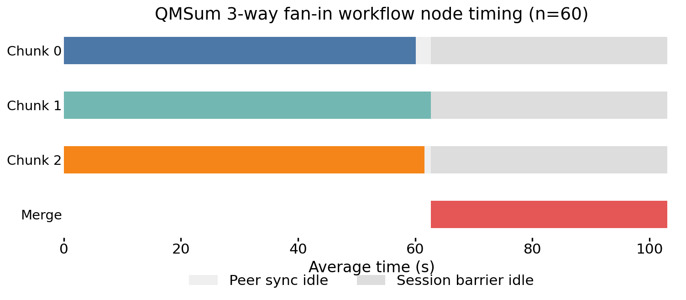
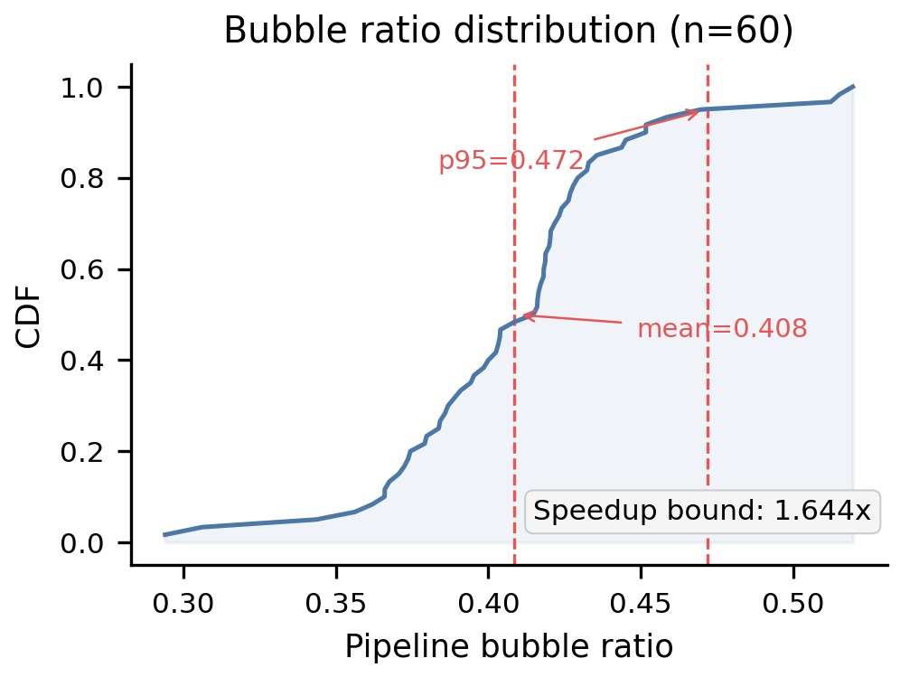
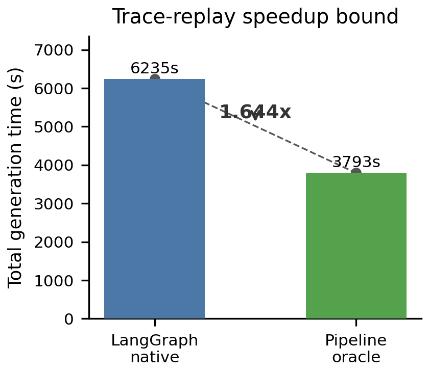
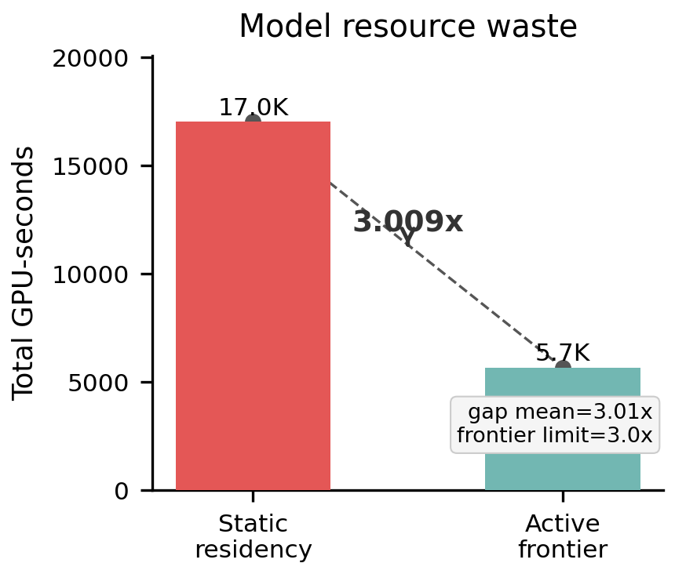

# 20260704 workflow motivation 实验结果

## 实验目的

本文根据 `docs/workflow/motivation_20260703.md` 执行动机实验。实验不复现 SAGA、
Kairos、Murakkab、Parrot 或 Grape，而是采用这些论文常见的 motivation 口径：选择代表性
workflow，固定采样或 trace，运行一个清晰 baseline，再用同一 trace 离线计算 oracle 或理论下限。

相关依据包括 SAGA 的 SWE-bench agent trace，Kairos 的 multi-agent workflow 特征分析，
Murakkab 的 trace-driven agentic workflow 编排，Parrot 的 map-reduce/chain summary 应用，
以及 `paper/reference/sc2026-agents.pdf` 中的 long document summarization 与 code generation
workflow。

## 实验设置

| workflow | 数据集 | 样本 | baseline | oracle |
|---|---:|---:|---|---|
| QMSum 3-way fan-in | QMSum `ALL/test` | 60 | LangGraph-style session-at-a-time DAG | Pipeline trace replay |
| MBPP chain | MBPP sanitized `test` | 60 | Static model residency | Active frontier lower bound |

QMSum 使用 3 个 Qwen3-4B chunk 节点和 1 个 Qwen3-8B merge 节点。质量评估使用 ROUGE
和外部 LLM judge。MBPP 使用 `coder -> tester -> reviewer -> repair -> final_tester` chain，
其中 coder 和 repair 使用 Qwen3-14B，reviewer 使用 Qwen3-8B，
tester 使用本地 deterministic evaluator。

## QMSum 3-way fan-in timing



**图 1: QMSum workflow 节点平均耗时分布（n=60）。** 条形宽度表示各节点平均执行时间
（chunk: 60–63s, merge: 40.4s）。浅灰色段为 chunk 完成到 merge 启动之间的**对等同步空闲**
（等待最慢 chunk 完成）；深灰色段为 merge 执行期间所有 chunk GPU 的**会话屏障空闲**
（无法推进下一个 session）。两类空闲合计 bubble ratio 0.408，stage utilization 仅 59%。



**图 2: Pipeline bubble ratio 的累积分布。** 60 个样本的 bubble ratio 均值 0.408，p95 达到
0.472。使用离线流水线重放计算的 speedup 理论上限为 1.644x，即消除 fan-in barrier 后
generation 时间可减少近 40%。



**图 3: Baseline 与 oracle 总耗时对比。** LangGraph-style session-at-a-time DAG 累计
6235s，同一组节点耗时离线流水线重放为 3793s，speedup 理论上限为 1.644x。

| 指标 | 数值 |
|---|---:|
| generation total | 6235.192 s |
| pipeline oracle total | 3792.788 s |
| speedup upper bound | 1.644x |
| pipeline idle mean | 127.355 s |
| pipeline idle p95 | 143.847 s |
| pipeline bubble ratio mean | 0.408 |
| chunk-stage utilization | 0.591 |
| ROUGE-L | 0.1013 |
| LLM score | 1.5333 |
| judge pass rate | 0.1000 |

结果说明：LangGraph-style session-at-a-time DAG 在每个样本内等待最慢 chunk，并且在 merge
执行期间不能让 chunk worker 推进下一个 session。`pipeline_oracle` 使用同一批节点耗时进行离线
流水线重放，因此 speedup 是理论上限，不引入新的模型质量变量。

## MBPP chain resource gap



**图 4: 静态模型驻留反事实与 active frontier 的资源对比。** 该反事实假设 workflow
全生命周期内同时驻留 coder（14B）、reviewer（8B）和 repair（14B）三个模型实例，但任意时刻
trace 中真实活跃的 LLM frontier 只有一个节点，资源差距为 3.009x。

| 指标 | 数值 |
|---|---:|
| end-to-end mean | 94.541 s |
| resident GPU-seconds | 17017.460 |
| active GPU-seconds | 5656.421 |
| resource gap | 3.009x |
| frontier gap | 3.000x |
| aggregate idle / session (3 model nodes) | 189.351 GPU-s |
| idle / model / session | 63.117 GPU-s |
| pass@1 | 0.3500 |

结果说明：在 fixed chain 中，任意时刻 trace 中真实活跃的 LLM frontier 只有一个节点；静态驻留量
由每个 session 的起止时间和三个模型节点推导，并非硬件驻留遥测。该反事实的 resident GPU-seconds
是 active 的三倍以上，量化了本地模型实例加载、复用、预取和卸载策略的优化空间。

## 输出文件

```text
output/motivation/
```

核心文件：

```text
output/motivation/qmsum_3way_trace.jsonl
output/motivation/qmsum_3way_results.jsonl
output/motivation/qmsum_3way_summary.json
output/motivation/mbpp_chain_trace.jsonl
output/motivation/mbpp_chain_results.jsonl
output/motivation/mbpp_chain_summary.json
```

生命周期图由上述 trace/summary 生成；预测安全图使用
`docs/train/gnn_model_llm_only_full_retrain_20260702.md` 中的 held-out 指标。两张论文图可确定性重生成：

```bash
uv run python scripts/motivation/plot_paper_motivation.py
```

输出文件：

```text
paper/hpca2027-sagepilot/figures/lifecycle_motivation.pdf
paper/hpca2027-sagepilot/figures/prediction_safety_evidence.pdf
```

## 结论

这两个 motivation 实验支持同一个系统动机：现有 workflow DAG baseline 能表达依赖关系，
但不显式管理本地模型实例生命周期和跨 session 流水线机会。QMSum 展示粗粒度 fan-in barrier
带来的 pipeline bubble；MBPP 展示静态模型驻留相对 active frontier 的资源浪费。两者都说明后续
调度系统存在可量化的优化空间。
